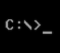

### Приветствую! 👋

**Мой стек:** Swift, Xcode, UIKit, вёрстка кодом с AutoLayout, MVC, MVP, MVVM, URLSession, JSON, Codable, REST API, OAuth 2.0, DispatchQueue, CoreData, UserDefaults, CoreAnimation, WebView, UI-тесты и Unit-тесты (XCTest), Swift Package Manager (SPM), CocoaPods, git, github

### Здесь можно посмотреть мои проекты

#### [SWTracker](https://github.com/DemidenGo/SWTracker) - поиск ресурсов из фильмов серии Star Wars

**Описание:** приложение позволяет искать ресурсы из фильмов серии Star Wars (Звездные войны) и сохранять их в Избранном. Также есть возможность просмотра детальной информации по выбранному ресурсу. Для получения данных используется открытый API SWAPI https://swapi.dev/api/  
**Технологии:** Swift, MVVM (с использованием propertyWrapper), UIKit, вёрстка кодом с AutoLayout, URLSession, URLRequest, JSONDecoder, Codable, DispatchQueue, Swift Package Manager (SPM), ProgressHUD.  
**Ссылка на проект:** [https://github.com/DemidenGo/SWTracker](https://github.com/DemidenGo/SWTracker)

#### [FakeNFT](https://github.com/demidengo/fakenft)

**Описание:** приложение помогает пользователям просматривать и покупать NFT (Non-Fungible Token). По сути имитация маркетплейса, специализирующегося на NFT. Функционал покупки иммитируется с помощью мокового сервера [mockapi.io](https://mockapi.io). При разработке приложения отрабатывались навыки работы в команде. Моя зона ответственности - экран профиля.  
**Технологии:** Swift, MVVM (без combine и React-фреймворков), propertyWrapper, Key-value observing (KVO), NotificationCenter, UserDefaults, UIKit, вёрстка кодом с AutoLayout, UIView.animate, URLSession, URLRequest, JSONDecoder, Codable, DispatchGroup, WKWebView, URL validation, DispatchQueue, блокировка UI, UI-тесты и Unit-тесты (XCTest), Swift Package Manager (SPM), Kingfisher, ProgressHUD.  
**Ссылка на проект:** [https://github.com/demidengo/fakenft](https://github.com/demidengo/fakenft)

#### [TrackerApp](https://github.com/demidengo/trackerapp)

**Описание:** приложение помогает пользователям формировать полезные привычки и контролировать их выполнение. Позволяет вести контроль привычек по дням недели. Приложение состоит из карточек-трекеров, которые создает пользователь. Карточки отсортированы по категориям. Выводится статистика прогресса по привычкам. В приложении выполнена локализация и реализована тёмная тема.  
**Технологии:** Swift, MVC, MVVM, UIKit, Autolayout, CoreData, NSFetchedResultsController, NSPredicate, NSSortDescriptor, ObservableWrapper, BatchUpdates, YandexMobileMetrica, Swift Package Manager (SPM), CocoaPods, SnapshotTesting, Color Marshalling.  
**Ссылка на проект:** [https://github.com/demidengo/trackerapp](https://github.com/demidengo/trackerapp)

#### [ImageFeed](https://github.com/demidengo/imagefeed)

**Описание:** многостраничное приложение для просмотра изображений через [API Unsplash](https://unsplash.com/documentation). Позволяет просматривать бесконечную ленту картинок из Unsplash Editorial. Пользователи могут просматривать каждое изображение отдельно, добавлять изображения в избранное и удалять оттуда. Также имеется возможность просмотра краткой информации из профиля пользователя на сайте [unsplash.com](https://unsplash.com). В приложении реализована авторизация через [OAuth2 Unsplash](https://unsplash.com/documentation/user-authentication-workflow).  
**Технологии:** Swift, MVP, UIKit, Autolayout, OAuth 2.0, URLSession, URLComponents, WebView, NotificationCenter, KVO, Kingfisher, SwiftKeychainWrapper, Decodable, DispatchQueue, Swift Package Manager (SPM), Core Animation, SplashViewController, Unit Tests, XCTest.  
**Ссылка на проект:** [https://github.com/demidengo/imagefeed](https://github.com/demidengo/imagefeed)

#### [TradingView](https://github.com/DemidenGo/TradingView)

**Описание:** Тестовое приложение на основе платформы tradingview.com.
**Технологии:** Swift, UIKit, Autolayout, MVVM  
**Ссылка на проект:** [https://github.com/DemidenGo/TradingView](https://github.com/DemidenGo/TradingView)

#### [Todolist](https://github.com/demidengo/todolist)

**Описание:** простое и лёгкое приложение для составления списка задач. Позволяет добавить новую задачу, отметить её выполненной и удалить.  
**Технологии:** Swift, UIKit, Autolayout, MVVM, UserDefaults, NotificationCenter.
**Ссылка на проект:** [https://github.com/DemidenGo/Todolist](https://github.com/DemidenGo/Todolist)

#### [MovieQuiz](https://github.com/demidengo/moviequiz-ios)

**Описание:** одностраничное приложение с квизами о фильмах из топ-250 рейтинга IMDb. Информация о фильмах запрашивается через [API IMDb](https://imdb-api.com/api#Top250Movies-header). Пользователь приложения последовательно отвечает на вопросы о рейтинге фильма. По итогам каждого раунда игры показывается статистика о количестве правильных ответов и лучших результатах пользователя. Цель игры - правильно ответить на все 10 вопросов раунда. ‼️ К сожалению, сервис imdb.com с июля 2023 года убрал возможность бесплатного тестового доступа к своему API. Теперь доступ к API IMDb только по платной подписке. По этой причине функциональность приложения ограничена. Для восстановления функциональности необходимо использовать актуальный API Key. Ключ задаётся по адресу /MovieQuiz/Resources/Constants.swift (константа apiKey).  
**Технологии:** Swift, MVP, UIKit, Storyboard, DispatchQueue, UserDefaults, URLSession, JSONDecoder, Decodable, API IMDb, XCTest, unit tests, UI tests.  
**Ссылка на проект:** [https://github.com/demidengo/moviequiz-ios](https://github.com/demidengo/moviequiz-ios)

#### [FakeVK.com](https://github.com/DemidenGo/netology-ios-homeworks)

**Описание:** учебное приложение, которое имитирует мобильное приложение VK.com.  
**Технологии:** Swift, MVC, UIKit, Autolayout, UITabBarController, UITableView, UICollectionView, UIView.animate, NotificationCenter.  
**Ссылка на проект:** [https://github.com/DemidenGo/netology-ios-homeworks](https://github.com/DemidenGo/netology-ios-homeworks)

### Спасибо за внимание!

